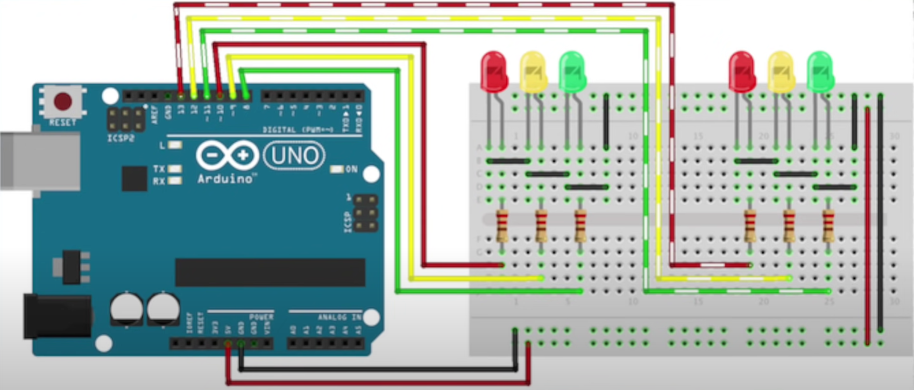

# Dobbelt Traffiklys
### Arduino Uno R3 dobbelt traffiklys på breadboard.

 Som basal træning af Arduino komponenter samt kabelføring, projektet er bygget under uddannelsen "Datatekniker med speciale i programmering". 
Hovedsageligt som opstartsprojekt og indgangsvinkel til Arduino verdenen.  

 <b>Gif af projektet:</b> 

### Til projektet er der benyttet følgende:

* 16 stk. han/han kabler.
* 6 stk. 220 ohm modstande. 
* 2 røde pærer
* 2 gule pærer
* 2 røde pærer
* 1 stk. Arduino UNO R3 

 <b>Kabelføring:</b> 

